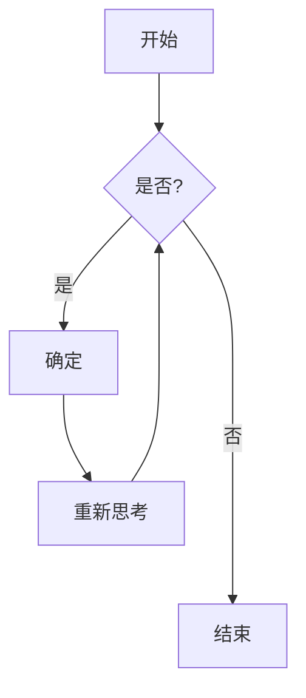
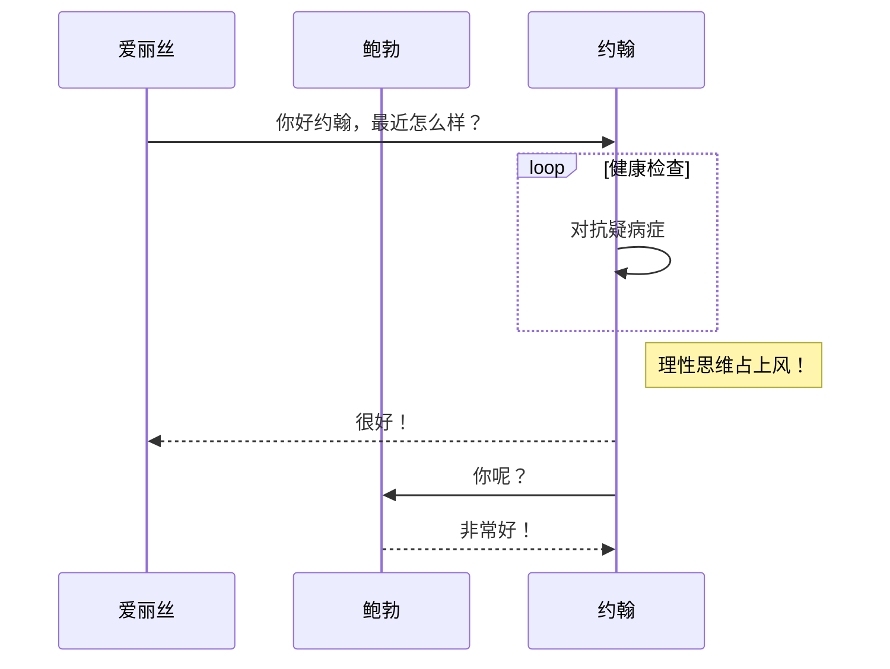
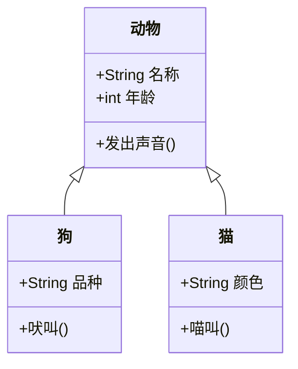
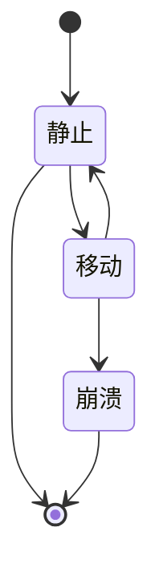
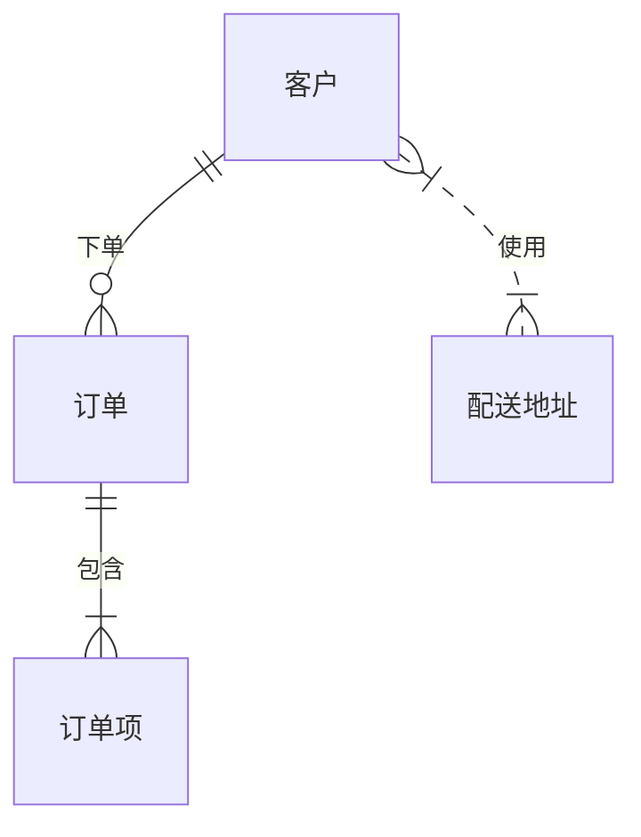
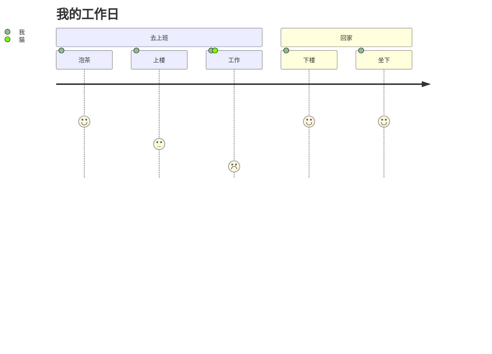
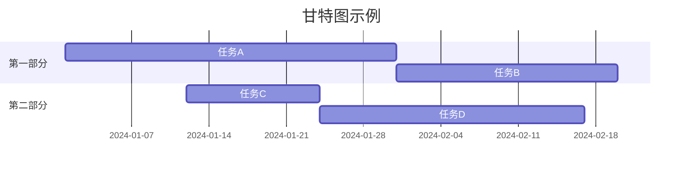
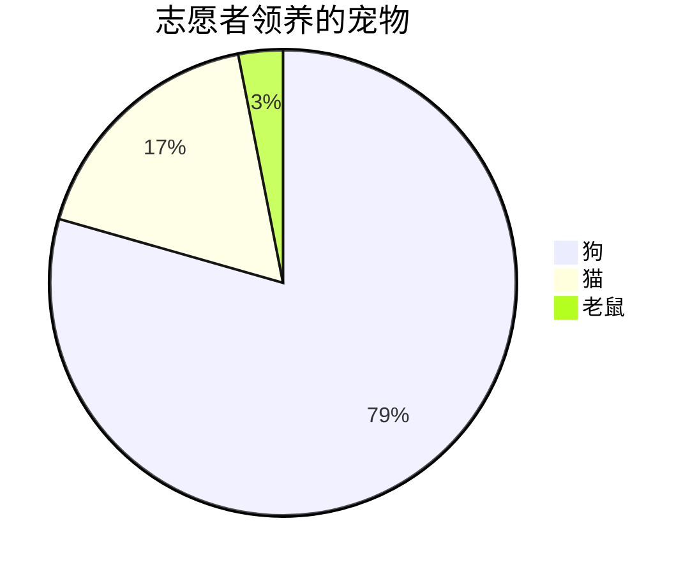
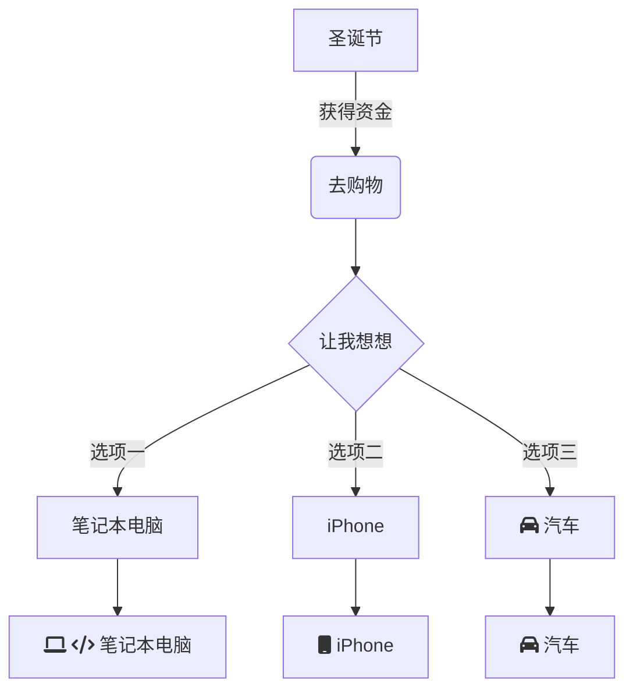

---

title: Mermaid 图表测试
description: 测试各种 Mermaid 图表类型，确保正确渲染和主题集成。
date: 2025-09-07
tags:

· 格式化
· obsidian
  draft: false
  image:
  imageAlt:
  imageOG: false
  hideCoverImage: false
  hideTOC: false
  targetKeyword:
  aliases:
· mermaid-test
· mermaid-diagram-test

---

本文测试 Mermaid 图表集成，使用各种图表类型确保正确渲染和主题兼容性。

流程图



序列图



类图



状态图



实体关系图



用户旅程图



甘特图



饼图



Git 图谱


带样式的复杂流程图



错误处理测试

这应该显示错误状态：

```mermaid
graph TD
    A[无效语法
    B --> C
    无效命令
```

主题集成

图表应自动适应当前主题（亮色/暗色），并使用主题颜色以更好地与整体设计集成。

响应式设计

所有图表都应该是响应式的，在移动设备上表现良好，具有适当的缩放和溢出处理。